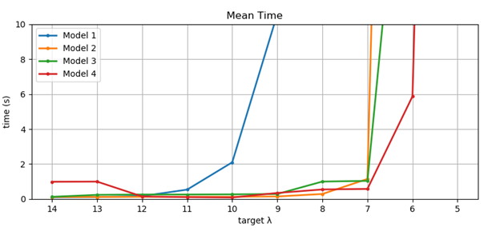
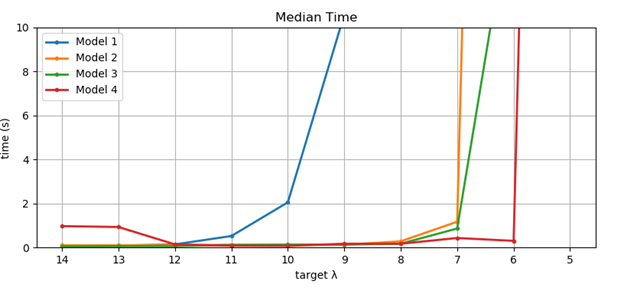

Better formating can be found here: https://docs.google.com/document/d/1JGLN4hDQd3mWTpa4k4VTuRyj2cgApeOzu8f2Oh2YPQo/edit?usp=sharing

# Experimental Analysis of Algorithms Report
 By Rares Dima & Cristian Simionescu

## Problem Description and initial solution models               

The chosen problem is **065: Optimal Financial Portfolio Design**, also referred to as **OPD**, the problem was proposed by Pierre Flener, Jean-Noël Monette and is presented in an abstract fashion through a simple to explain requirement:

            	Given a matrix of a certain size, containing only the numbers 0 and 1, with each row having a specific number of 1’s, find a configuration for the matrix such that the maximum dot product between any 2 rows is minimized.

            	The problem has only 3 input parameters, **V**, **B** and **R**.

**V** and **B** are the matrix dimensions and **R** is the number of 1’s we must place on each row, making the problem become:

Given a 0/1 matrix of size **V**x**B**, with exactly **R** 1’s on each row, find a configuration for the matrix such that the maximum dot product between any 2 rows is minimized. This objective value is called **λ**.

 

The problem model uses **MiniZinc 2.3.2** as the optimization language and **Gecode 6.1.1** for the solver.

The **first iteration** of the model lacked any optimization at all and simply had the constraint that ensured the number of 1’s per row and the minimization objective and used an unoptimized implementation of the dot product.

The **second iteration** improved the dot product implementation using more features of the MiniZinc standard library and eliminating unnecessary bool->int->bool conversions.

	The **third iteration** introduced additional constraints to break symmetry in the solution space for both columns and rows as duplicate rows would produce an objective of exactly R, the maximum, and worst, value possible.

The symmetry breaking constraints are marked as *symmetry_breaking* for the solver because of additional optimizations that can be used by Gecode on constraints marked as such. The constraints are that each row and column has to be lexicographically greater or equal than the one before it.

Because of some implementation details of Gecode, while the median solve time decreased for the third model, some spikes appeared with up to 1000 times higher run times, spiking the average time. As the target **λ **decreases, the points that quickly lead to a solution also become rarer.

The **fourth iteration** changed the symmetry constraints to use greater not greater or equal comparison. The input dimensions are guaranteed to be small enough so that we do not „run out" of possible configurations of 1’s.

 

The problem instance on which the tests were run was **V=10, B=37, R=14 **and the models were timed according to how fast on average they would achieve a certain **λ **value. The possible values for **λ** are 5..1

<table>
  <tr>
    <td></td>
    <td>Target λ</td>
    <td></td>
    <td></td>
    <td></td>
    <td></td>
    <td></td>
    <td></td>
    <td></td>
    <td></td>
    <td></td>
  </tr>
  <tr>
    <td></td>
    <td>14</td>
    <td>13</td>
    <td>12</td>
    <td>11</td>
    <td>10</td>
    <td>9</td>
    <td>8</td>
    <td>7</td>
    <td>6</td>
    <td>5</td>
  </tr>
  <tr>
    <td>Time (s)
(100 runs)
----------------
Model Iteration</td>
    <td>Mean</td>
    <td>Mean</td>
    <td>Mean</td>
    <td>Mean</td>
    <td>Mean</td>
    <td>Mean</td>
    <td>Mean</td>
    <td>Mean</td>
    <td>Mean</td>
    <td>Mean</td>
  </tr>
  <tr>
    <td>1</td>
    <td>0.10</td>
    <td>0.11</td>
    <td>0.17</td>
    <td>0.54</td>
    <td>2.10</td>
    <td>10.57</td>
    <td>56.15</td>
    <td>100+</td>
    <td> </td>
    <td> </td>
  </tr>
  <tr>
    <td>2</td>
    <td>0.12</td>
    <td>0.12</td>
    <td>0.13</td>
    <td>0.13</td>
    <td>0.13</td>
    <td>0.15</td>
    <td>0.29</td>
    <td>1.15</td>
    <td>100+</td>
    <td> </td>
  </tr>
  <tr>
    <td>3</td>
    <td>0.13</td>
    <td>0.24</td>
    <td>0.26</td>
    <td> 0.26</td>
    <td>0.27 </td>
    <td> 0.29</td>
    <td>1.00 </td>
    <td> 1.04</td>
    <td>27.59 </td>
    <td>100+ </td>
  </tr>
  <tr>
    <td>4</td>
    <td>0.99</td>
    <td>1.00</td>
    <td>0.15</td>
    <td>0.11</td>
    <td>0.09</td>
    <td>0.35</td>
    <td>0.55</td>
    <td>0.58</td>
    <td>5.87</td>
    <td> </td>
  </tr>
</table>

 

<table>
  <tr>
    <td></td>
    <td>Target λ</td>
    <td></td>
    <td></td>
    <td></td>
    <td></td>
    <td></td>
    <td></td>
    <td></td>
    <td></td>
    <td></td>
  </tr>
  <tr>
    <td></td>
    <td>14</td>
    <td>13</td>
    <td>12</td>
    <td>11</td>
    <td>10</td>
    <td>9</td>
    <td>8</td>
    <td>7</td>
    <td>6</td>
    <td>5</td>
  </tr>
  <tr>
    <td>Time (s)
(100 runs)
----------------
Model Iteration</td>
    <td>Median</td>
    <td>Median</td>
    <td>Median</td>
    <td>Median</td>
    <td>Median</td>
    <td>Median</td>
    <td>Median</td>
    <td>Median</td>
    <td>Median</td>
    <td>Median</td>
  </tr>
  <tr>
    <td>1</td>
    <td>0.09</td>
    <td>0.09</td>
    <td>0.15</td>
    <td>0.53</td>
    <td>2.06</td>
    <td>10.59</td>
    <td>59.26</td>
    <td>100+</td>
    <td> </td>
    <td> </td>
  </tr>
  <tr>
    <td>2</td>
    <td>0.11</td>
    <td>0.11</td>
    <td>0.12</td>
    <td>0.12</td>
    <td>0.12</td>
    <td>0.13</td>
    <td>0.29</td>
    <td>1.18</td>
    <td>100+</td>
    <td> </td>
  </tr>
  <tr>
    <td>3</td>
    <td>0.06</td>
    <td>0.07</td>
    <td>0.07</td>
    <td> 0.13</td>
    <td>0.14 </td>
    <td> 0.14</td>
    <td> 0.18</td>
    <td>0.87 </td>
    <td>16.37 </td>
    <td> 100+</td>
  </tr>
  <tr>
    <td>4</td>
    <td>0.98</td>
    <td>0.94</td>
    <td>0.15</td>
    <td>0.09</td>
    <td>0.08</td>
    <td>0.18</td>
    <td>0.18</td>
    <td>0.44</td>
    <td>0.31</td>
    <td> </td>
  </tr>
</table>

 

            	As the target **λ **decreases, the points that quickly lead to a solution also become rarer. For the 3rd iteration of the model about 30-40% of the runs resulted in spikes in the runtime. The problem seemed to decrease to only about 5% for the 4th iteration of the model.

While we experimented with artificial neural networks and Differentiable Quadratic Programming, the problem seemed too difficult for the architectures we used and it led to poor results.

## Best Solution Found

The algorithm that had the most success was a Genetic Algorithm. The implementation details are as follows:

**1.**       **Encoding**

* The algorithm is real-coded.

* A binary-coded algorithm would not have made sense with regards to the defined individual and operator architecture (explained below).

**2.**       **Individual Architecture**

*  A candidate solution is a 0/1 matrix where each row has exactly as many 1’s as are specified by the **R** input parameter (part of the problem instance).

* Given that on each row is rare, usually only about 0.25 – 0.3 of the elements are 1’s, it makes more sense from a space-wise perspective to simply store the positions of the 1’s rather than the entire (rare) row.

* Each row is represented by the set of indices of the elements that are equal to 1.

* An individual in a list of these rows (sets).

**3.**       **Selection**

* Tournament selection (using a tournament size of **k**) was used because of its ability to counter selection pressure and give all but the worst **k-1** individuals in the population a change of survival.

* In Tournament selection if it is desired to select **n** individuals then the current population will be randomly sampled **n** times with a sample size of **k** and from each sample the best individual is placed into the new population.

* Given that **k** is usually small (2-3, at most 5), few individuals will have no chance of success so diversity reduction will not be a concern.

**4.**       **Crossover**

* Each row-set of an individual will be referred to as a gene.

* The recombination of 2 genes goes as follows: from each gene a number of indices are removed and inserted into the other gene.

* The genes are effectively exchanging a number of indices.

* The number of indices to be exchanged is dictated by the parameter **CX_K**.

* To recombine 2 individuals a custom **1-point** crossover was used.

* In this crossover a row-set is selected as the crossover point.

* In the child the row-sets before the crossover point are copied from the 1st parent.

* The row-sets after the crossover point are copied from the 2nd parent.

* The crossover point row-set is obtained by recombining the row-set at that position from both parent using the gene-recombination procedure detailed above.

**5.**       **Mutation**

* The mutation of a gene is defined as inserting some number of **new** indices into the gene and removing some previously existing indices from the gene.

* This effectively „replaces" or „randomizes” some indices.

* The number of replaced indices is dictated by the parameter **MUT_K**.

* An individual is mutated by selecting some row-sets (each row-set is selected with a probability) and applying the above described mutation on it.

* The probability for a row-set to be mutated is dictated by the parameter **MUT_GENEPB**.

**6.**       **Optimizations**

* **Elitism** refers to guaranteeing that at each generation the top **k** individuals will survive into the next generation so that good solutions are preserved.

* The number of elite individuals is usually small (1-3) because a large amount of elitism will quickly spread the good genes throughout the population and lead to stagnation due to lack of diversity.

* Each generation a number of individuals are also randomly re-generated from scratch introducing more diversity into the population.

As a general conclusion it seems that the OPD problem has a highly fox-hole-like topology, meaning that the optima have very narrow basins of attraction and getting certain optima is usually more because of the random generation of individuals.

## Results and Analysis

We compared our best solution to the previous one described in an earlier section. In order to obtain statistically relevant results we ran each experiment 100 times. This was necessary since we had to account for the random behavior of Genetic Algorithms, which not only can have drastically different results based on the initialization of the first population but which introduce a large randomness factor with each of its operators. We had to account for this in order to be sure our comparison was reflective of actual general behavior of the two implementations.

Our set of experiments consisted of 4 distinct problem instances, each one being representative for a certain problem size. As such our problem instances were:

1. Toy: (10, 37, 14, 5)

2. Small: (6, 50, 25, 10)

3. Medium: (10, 100, 30, 8)

4. Real: (15, 350, 100, 30)

To remind you, the tuple: **(V,B,R,λ) V**-number of lines **B-**Number of columns, **R-**Number of 1 we have to place on each row and **λ**-The known best fitness, for the first 3 instances this is known to be the real minimum.

<table>
  <tr>
    <td>Time stats</td>
    <td>Toy Old</td>
    <td>Toy New</td>
    <td>Small Old</td>
    <td>Small New</td>
    <td>Medium Old</td>
    <td>Medium New</td>
    <td>Real Old</td>
    <td>Real New</td>
  </tr>
  <tr>
    <td>Mean time</td>
    <td>35.051	</td>
    <td>22.2009</td>
    <td>25.7482</td>
    <td>23.9098</td>
    <td>48.9504</td>
    <td>47.5145</td>
    <td>164.636</td>
    <td>160.21</td>
  </tr>
  <tr>
    <td>Max time</td>
    <td>36.5395</td>
    <td>24.0144</td>
    <td>27.3284</td>
    <td>26.0413	</td>
    <td>50.5753</td>
    <td>49.6982	</td>
    <td>172.55</td>
    <td>168.316</td>
  </tr>
  <tr>
    <td>Min time</td>
    <td>33.4344</td>
    <td>20.186</td>
    <td>24.1471</td>
    <td>22.5133</td>
    <td>47.2948</td>
    <td>45.5792	</td>
    <td>95.073</td>
    <td>61.2374</td>
  </tr>
  <tr>
    <td>STD time</td>
    <td>0.56678</td>
    <td>1.18437</td>
    <td>0.600259	</td>
    <td>0.870654</td>
    <td>0.674636	</td>
    <td>0.964341</td>
    <td>16.7751</td>
    <td>17.0917</td>
  </tr>
  <tr>
    <td>Mean timeout</td>
    <td>0</td>
    <td>0</td>
    <td>0</td>
    <td>0</td>
    <td>0</td>
    <td>0</td>
    <td>0.17</td>
    <td>0.19</td>
  </tr>
  <tr>
    <td>Time conf-int</td>
    <td>34.938,
35.163</td>
    <td>21.965,
22.435</td>
    <td>25.629,
25.867</td>
    <td>23.737,
24.082</td>
    <td>48.816,
49.084</td>
    <td>47.323,
47.705</td>
    <td>161.307,
167.964</td>
    <td>156.818,
163.601</td>
  </tr>
  <tr>
    <td>Sem time</td>
    <td>0.05667</td>
    <td>0.118437	</td>
    <td>0.060025</td>
    <td>0.0870654	</td>
    <td>0.0674636</td>
    <td>0.0964341</td>
    <td>1.67751</td>
    <td>1.70917	</td>
  </tr>
</table>

*Mean timeout - the average amount of times the algorithm timed out

*Confidence interval with 95%

*Sem - standard error of the mean with 1 degree of freedom

<table>
  <tr>
    <td>Fitness stats</td>
    <td>Toy Old</td>
    <td>Toy New</td>
    <td>Small Old</td>
    <td>Small New</td>
    <td>Medium Old</td>
    <td>Medium New</td>
    <td>Real Old</td>
    <td>Real New</td>
  </tr>
  <tr>
    <td>Mean fitness</td>
    <td>6.51374</td>
    <td>6.48117</td>
    <td>12.5097</td>
    <td>12.4722</td>
    <td>10.4378</td>
    <td>10.3935</td>
    <td>32.2496	</td>
    <td>32.1291</td>
  </tr>
  <tr>
    <td>Max fitness</td>
    <td>11.59</td>
    <td>11.39</td>
    <td>19.78</td>
    <td>19.27	</td>
    <td>18.51</td>
    <td>17.94	</td>
    <td>46.67</td>
    <td>45.26</td>
  </tr>
  <tr>
    <td>Min fitness</td>
    <td>6</td>
    <td>6</td>
    <td>11.98</td>
    <td>11.99</td>
    <td>9.69</td>
    <td>9.68	</td>
    <td>30.84</td>
    <td>30.81</td>
  </tr>
  <tr>
    <td>STD fitness</td>
    <td>0</td>
    <td>0</td>
    <td>0.14</td>
    <td>0.0994987</td>
    <td>0.462493	</td>
    <td>0.466476</td>
    <td>0.392938</td>
    <td>0.392301</td>
  </tr>
  <tr>
    <td>Fitness conf-int</td>
    <td>6,	6</td>
    <td>6,
6</td>
    <td>11.9521,
12.0079</td>
    <td>11.9702,
12.0098</td>
    <td>9.59777,
9.78223</td>
    <td>9.58697,
9.77303</td>
    <td>30.7616,
30.9184</td>
    <td>30.7318,
30.8882</td>
  </tr>
  <tr>
    <td>Sem fitness</td>
    <td>0</td>
    <td>0	</td>
    <td>0.014070</td>
    <td>0.01	</td>
    <td>0.0464823</td>
    <td>0.0468826</td>
    <td>0.039491</td>
    <td>0.0394277	</td>
  </tr>
</table>

* Lower fitness is better

## Conclusions

Since our algorithms are capable of reaching the known minima most of the time the difference in terms of fitness scores is extremely small even on real-life instance sizes.
A noticeable improvement can be seen in the time our two implementations take to converge on said minima. 

The difference between the old and new implementation, on these instances, is only seen on convergence time. This could translate into using larger population sizes and number of epochs, using the new algorithm, in cases where the instances are harder to solve and it should result in better fitness scores but with comparable resource usage.

Another thing which can be seen from the data being that the new algorithm, which makes use of migration, is a very small bit less "stable"/”consistent”, having wider deviations and number of timeout runs, this is to be expected since the extra operation introduces another level of randomness into the system.

## Automatic Parameter Search and Problem Instance Prediction

For automatic parameter search, we used the **hyperopt **library. From  this library we used their provided implementation of **Tree of Parzen Estimators (TPE) **to search for better meta-parameter configurations for our population sizes, mutation and crossover, elitism and migration probabilities and values. 

Just as we suspected from our own experimenting, the algorithm seemed to consider that larger population sizes and higher mutation rates are the best fit for our problem, thus favoring exploration rather than exploitation, tipping our algorithm towards a random search behavior. 

This seems to be in line with our assumption that the problem seems to have a fox-hole-like topology.

We also created a model to predict expected running times of our algorithm for a given instance. Using the stats from the above experiments with the inclusion of another 40 problem configurations we used **AdaBoost **with regression decision trees to predict a running time in seconds for a given configuration. The model seem to perform very well, doing a leave-one-out validation of our data-points we obtained a **R****2** of **~0.93**
